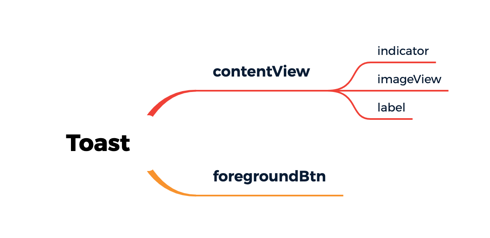

# Toast

用于展示提示信息的简易UI。
考虑到app中常用的提示类型，UI构成如下
<br/>


# Installation

```
支持Swift Package Manager
```

# Usage
```
let toast = Toast(frame: view.bounds)
toast.indicator.startAnimating()
toast.label.text = "loading..."
toast.isUserInteractionBlocked = true
view.addSubview(toast)


doSomework {
    toast.isUserInteractionBlocked = false
    toast.indicator.stopAnimating()
    toast.imageView.image = UIImage(named: "done")
    toast.label.text = "this is a long text this is a long text this is a long text this is a long text this is a long text this is a long text this is a long text this is a long text this is a long text this is a long text "
    toast.label.numberOfLines = 2
    toast.dismiss(3)
}
```
或者直接使用基于`UIView、UIViewController`的Toast扩展
```
showLoading("loading...")
doSomework { [weak self] in
    self?.showToast(longText, numberOfLines: 2)
}
```

